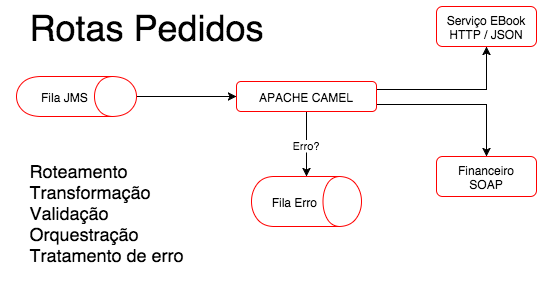

# integration-apache-camel
Apache Camel - Tests

### Docs

Cammel Docs
  - [Official config](http://camel.apache.org/file2.html)
  - [Components](https://camel.apache.org/components/latest/index.html)
  - [RouteBuilder](http://camel.apache.org/maven/current/camel-core/apidocs/org/apache/camel/builder/RouteBuilder.html)
  - [splitter](https://camel.apache.org/components/latest/eips/split-eip.html)
  - [Component Simple](https://camel.apache.org/components/latest/languages/simple-language.html)
  - [Component constant](https://camel.apache.org/components/latest/languages/constant-language.html)
  - [Component http](https://camel.apache.org/components/latest/http-component.html)
  - [Component direct](https://camel.apache.org/components/latest/direct-component.html)
  - [Component seda](https://camel.apache.org/components/latest/seda-component.html)
    - A ideia do SEDA é que cada rota (e sub-rota) possua uma fila dedicada de entrada e as rotas enviam mensagens para essas filas para se comunicar. Dentro dessa arquitetura, as mensagens são chamadas de eventos. A rota fica então consumindo as mensagens/eventos da fila, tudo funcionando em paralelo.

Integration Patterns
  - [Message](https://camel.apache.org/components/latest/eips/message.html)
  - [Event Message](https://camel.apache.org/components/latest/eips/event-message.html)

EIP - Enterprise Integration Patterns
  - [Integration Styles](https://www.enterpriseintegrationpatterns.com/patterns/messaging/IntegrationStylesIntro.html)
    - [File Transter](https://www.enterpriseintegrationpatterns.com/patterns/messaging/FileTransferIntegration.html)
    - [Shared Database Integration](https://www.enterpriseintegrationpatterns.com/patterns/messaging/SharedDataBaseIntegration.html)
    - [Messaging](https://www.enterpriseintegrationpatterns.com/patterns/messaging/Messaging.html)
    - [RPC - Remote Procedure Call](https://www.enterpriseintegrationpatterns.com/patterns/messaging/EncapsulatedSynchronousIntegration.html)

### Diagram

